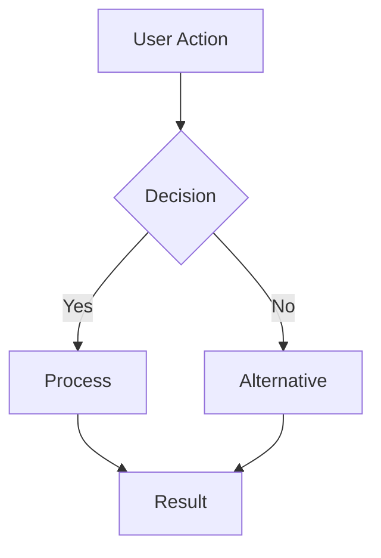

# Product Requirements Document (PRD)

**Document Status**: [ ] Draft [ ] In Review [ ] Approved [ ] Archived  
**Version**: 1.0  
**Last Updated**: YYYY-MM-DD  
**Author**: [Your Name]  
**Reviewers**: [List of Reviewers]  

## Executive Summary

<!-- 2-3 sentences summarizing the feature/project -->

## Problem Statement

### Background
<!-- Context and current situation -->

### Problem Description
<!-- What specific problem are we solving? -->

### Impact
<!-- Who is affected and how? -->

## Goals and Objectives

### Primary Goals
1. <!-- Primary goal 1 -->
2. <!-- Primary goal 2 -->
3. <!-- Primary goal 3 -->

### Success Metrics
| Metric | Current Value | Target Value | Measurement Method |
|--------|---------------|--------------|-------------------|
| <!-- Metric 1 --> | <!-- Current --> | <!-- Target --> | <!-- How measured --> |
| <!-- Metric 2 --> | <!-- Current --> | <!-- Target --> | <!-- How measured --> |

## User Stories

### Story 1: [Title]
**As a** [user type]  
**I want to** [action]  
**So that** [benefit]  

**Acceptance Criteria:**
- [ ] Criteria 1
- [ ] Criteria 2
- [ ] Criteria 3

### Story 2: [Title]
**As a** [user type]  
**I want to** [action]  
**So that** [benefit]  

**Acceptance Criteria:**
- [ ] Criteria 1
- [ ] Criteria 2
- [ ] Criteria 3

## Requirements

### Functional Requirements

#### Must Have (P0)
1. **[Requirement Name]**
   - Description: <!-- Detailed description -->
   - Rationale: <!-- Why is this critical? -->
   - Dependencies: <!-- What does this depend on? -->

2. **[Requirement Name]**
   - Description: <!-- Detailed description -->
   - Rationale: <!-- Why is this critical? -->
   - Dependencies: <!-- What does this depend on? -->

#### Should Have (P1)
1. **[Requirement Name]**
   - Description: <!-- Detailed description -->
   - Rationale: <!-- Why is this important? -->

#### Nice to Have (P2)
1. **[Requirement Name]**
   - Description: <!-- Detailed description -->
   - Rationale: <!-- Why would this be beneficial? -->

### Non-Functional Requirements

#### Performance
- <!-- Response time requirements -->
- <!-- Throughput requirements -->
- <!-- Resource usage limits -->

#### Security
- <!-- Authentication requirements -->
- <!-- Authorization requirements -->
- <!-- Data protection requirements -->

#### Reliability
- <!-- Uptime requirements -->
- <!-- Error handling requirements -->
- <!-- Recovery requirements -->

#### Scalability
- <!-- Expected load -->
- <!-- Growth projections -->
- <!-- Scaling requirements -->

## Technical Constraints

### Architecture Constraints
- <!-- Must use Effect patterns -->
- <!-- Stream-based processing required -->
- <!-- Service boundaries -->

### Integration Constraints
- <!-- External systems -->
- <!-- API limitations -->
- <!-- Data format requirements -->

### Technology Stack
- **Frontend**: <!-- If applicable -->
- **Backend**: Effect, TypeScript
- **Database**: <!-- If applicable -->
- **Infrastructure**: <!-- Deployment target -->

## User Interface

### UI/UX Requirements
<!-- For TUI or other interfaces -->

### Mockups/Wireframes
<!-- Link to designs or ASCII art for TUI -->

### User Flow

## Dependencies

### Internal Dependencies
| Component | Team | Status | Notes |
|-----------|------|--------|-------|
| <!-- Component --> | <!-- Team --> | <!-- Status --> | <!-- Notes --> |

### External Dependencies
| Service/API | Purpose | Status | Risk |
|-------------|---------|--------|------|
| <!-- Service --> | <!-- Purpose --> | <!-- Status --> | <!-- Risk Level --> |

## Timeline

### Milestones
| Milestone | Target Date | Dependencies | Status |
|-----------|-------------|--------------|--------|
| PRD Approval | <!-- Date --> | <!-- Deps --> | <!-- Status --> |
| Technical Design | <!-- Date --> | <!-- Deps --> | <!-- Status --> |
| Implementation Start | <!-- Date --> | <!-- Deps --> | <!-- Status --> |
| Testing Complete | <!-- Date --> | <!-- Deps --> | <!-- Status --> |
| Production Deploy | <!-- Date --> | <!-- Deps --> | <!-- Status --> |

### Resource Allocation
- **Engineering**: <!-- X engineers for Y days -->
- **Design**: <!-- If applicable -->
- **QA**: <!-- Testing resources -->

## Risks and Mitigations

### Technical Risks
| Risk | Probability | Impact | Mitigation |
|------|-------------|--------|------------|
| <!-- Risk --> | High/Med/Low | High/Med/Low | <!-- Mitigation plan --> |

### Business Risks
| Risk | Probability | Impact | Mitigation |
|------|-------------|--------|------------|
| <!-- Risk --> | High/Med/Low | High/Med/Low | <!-- Mitigation plan --> |

## Launch Plan

### Rollout Strategy
- [ ] Feature flag implementation
- [ ] Phased rollout plan
- [ ] A/B testing approach
- [ ] Full launch criteria

### Communication Plan
- **Internal**: <!-- How to communicate to team -->
- **External**: <!-- User communication if needed -->

### Training Requirements
- <!-- Documentation needs -->
- <!-- Training sessions -->
- <!-- Support preparation -->

## Open Questions

1. **Question**: <!-- Open question -->
   - **Context**: <!-- Why this matters -->
   - **Decision Needed By**: <!-- Date -->
   - **Owner**: <!-- Who will resolve -->

2. **Question**: <!-- Open question -->
   - **Context**: <!-- Why this matters -->
   - **Decision Needed By**: <!-- Date -->
   - **Owner**: <!-- Who will resolve -->

## Appendices

### A. Glossary
| Term | Definition |
|------|------------|
| <!-- Term --> | <!-- Definition --> |

### B. References
- <!-- Link to related docs -->
- <!-- Link to research -->
- <!-- Link to competitive analysis -->

### C. Change Log
| Version | Date | Changes | Author |
|---------|------|---------|--------|
| 1.0 | <!-- Date --> | Initial draft | <!-- Author --> |

---

## Sign-off

### Approvals Required
- [ ] Product Manager: _________________ Date: _______
- [ ] Engineering Lead: ________________ Date: _______
- [ ] Design Lead: ____________________ Date: _______
- [ ] QA Lead: _______________________ Date: _______

### Notes
<!-- Any additional notes or context -->